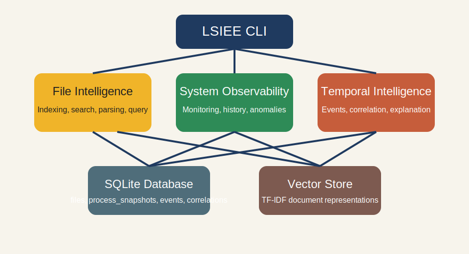
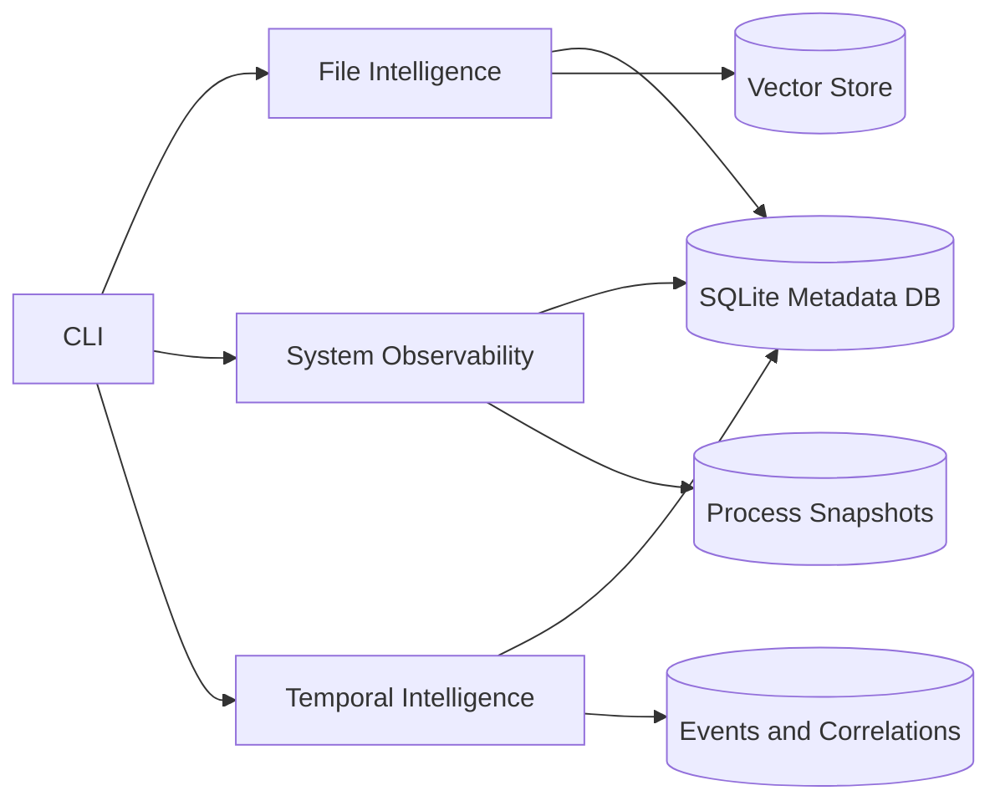

# LSIEE Architecture

## Overview

LSIEE is organized into three cooperating domains backed by SQLite and a lightweight vector store:

- File Intelligence scans local files, persists metadata, extracts text, and serves semantic search plus structured-data workflows.
- System Observability captures live process snapshots, stores system history, and runs anomaly detection plus alerting.
- Temporal Intelligence persists domain events, discovers correlations, and explains incidents using the combined evidence.

## Architecture Diagram

## Core Components

### File Intelligence

- `lsiee/file_intelligence/indexing/scanner.py`: directory traversal and exclusion handling
- `lsiee/file_intelligence/indexing/metadata_extractor.py`: filesystem metadata extraction
- `lsiee/file_intelligence/indexing/indexer.py`: metadata indexing orchestration and change detection
- `lsiee/file_intelligence/indexing/embedding_indexer.py`: semantic search document indexing
- `lsiee/file_intelligence/search/semantic_search.py`: TF-IDF search over extracted text
- `lsiee/file_intelligence/data_extraction/parsers.py`: CSV, Excel, and JSON parsing
- `lsiee/file_intelligence/data_extraction/query_executor.py`: safe natural-language query execution

### System Observability

- `lsiee/system_observability/monitoring/process_monitor.py`: live process snapshots
- `lsiee/system_observability/monitoring/system_metrics.py`: system-wide CPU, memory, disk, and network stats
- `lsiee/system_observability/monitoring/daemon.py`: foreground and detached monitoring daemon
- `lsiee/system_observability/monitoring/history.py`: historical query helpers
- `lsiee/system_observability/detection/anomaly_detector.py`: Isolation Forest anomaly detection
- `lsiee/system_observability/detection/alerting.py`: alert generation and persistence

### Temporal Intelligence

- `lsiee/temporal_intelligence/events/event_logger.py`: normalized event storage and querying
- `lsiee/temporal_intelligence/correlation/correlator.py`: support/confidence/lift correlation discovery
- `lsiee/temporal_intelligence/correlation/pattern_detector.py`: sequences, bursts, periodic events, cascades
- `lsiee/temporal_intelligence/explanation/root_cause.py`: evidence gathering, diagnosis, recommendations

## Data Flow

1. `index` scans directories, extracts metadata, stores file rows, and refreshes the vector store.
2. `search`, `inspect`, and `query` read file metadata/content from local stores only.
3. `monitor` captures live process and system snapshots into SQLite.
4. `detect-anomalies` reads process history, evaluates live snapshots, and persists alerts as events.
5. `explain` gathers process history, recent events, stored correlations, and historical occurrences to produce root-cause output.

## Storage

- SQLite:
  - `files`
  - `process_snapshots`
  - `events`
  - `correlations`
- JSON vector storage under the configured vector DB directory for TF-IDF search data.

## Reliability Notes

- SQLite connections are configured with WAL mode and performance-focused pragmas.
- CLI commands respect `LSIEE_DB_PATH`, `LSIEE_VECTOR_DB_PATH`, and `LSIEE_CONFIG_DIR` for isolated environments.
- Monitoring and demo flows can run against temporary databases without touching default user state.
