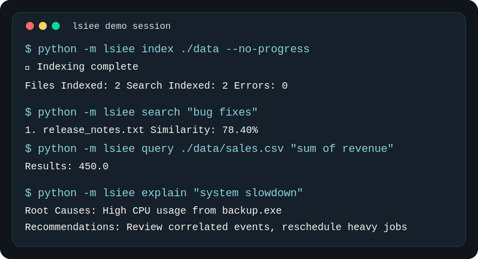

# LSIEE

Local System Intelligence & Execution Engine is a local-first toolkit for:

- File Intelligence: semantic search, structured inspection, and natural-language tabular queries
- System Observability: live process monitoring, stored history, and anomaly detection
- Temporal Intelligence: event logging, correlation discovery, and root-cause analysis

## Screenshots




## Installation

```bash
git clone https://github.com/yourusername/lsiee.git
cd lsiee
python -m venv venv
source venv/bin/activate
pip install -r requirements.txt
pip install -r requirements-dev.txt
```

## Quick Start

```bash
venv/bin/python scripts/verify_installation.py
venv/bin/python -m lsiee index ~/Documents
venv/bin/python -m lsiee search "quarterly budget reports"
venv/bin/python -m lsiee inspect data/sales.csv
venv/bin/python -m lsiee query data/sales.csv "sum of revenue by region"
venv/bin/python -m lsiee monitor --start --iterations 1 --interval 0.1
venv/bin/python -m lsiee monitor --detect-anomalies
venv/bin/python -m lsiee explain "system slowdown"
```

## Commands

| Command | Purpose |
| --- | --- |
| `venv/bin/python -m lsiee index <directory>` | Index files and refresh the semantic search store |
| `venv/bin/python -m lsiee status` | Show database and indexing status |
| `venv/bin/python -m lsiee search "<query>"` | Run semantic search across indexed files |
| `venv/bin/python -m lsiee inspect <file>` | Inspect CSV, Excel, or JSON structure |
| `venv/bin/python -m lsiee query <file> "<query>"` | Run safe read-only natural-language tabular queries |
| `venv/bin/python -m lsiee monitor --top-cpu` | Show live top CPU processes |
| `venv/bin/python -m lsiee monitor --system` | Show live CPU, memory, disk, and network metrics |
| `venv/bin/python -m lsiee monitor --start` | Start the background monitoring daemon |
| `venv/bin/python -m lsiee monitor --detect-anomalies` | Detect anomalies from recent history and log alerts |
| `venv/bin/python -m lsiee monitor --alert-history` | Show persisted alerts from the events store |
| `venv/bin/python -m lsiee explain "<issue>"` | Diagnose an incident using temporal evidence |

## Documentation

- [QUICK_START.md](QUICK_START.md)
- [ARCHITECTURE.md](ARCHITECTURE.md)
- [API_REFERENCE.md](API_REFERENCE.md)
- [USER_GUIDE.md](USER_GUIDE.md)
- [DEVELOPMENT.md](DEVELOPMENT.md)
- [PERFORMANCE.md](PERFORMANCE.md)

## Demo

Run the demo in an isolated temp workspace:

```bash
./scripts/demo.sh
```

The script creates sample files, points LSIEE at temp-local databases, and walks through indexing, search, inspection, querying, monitoring, anomaly detection, and explanation.

## Quality Gates

```bash
venv/bin/python scripts/verify_installation.py
venv/bin/pytest -q
venv/bin/python -m black --check lsiee tests scripts
venv/bin/python -m isort --check-only lsiee tests scripts
venv/bin/python -m flake8 lsiee tests scripts
```

## License

MIT. See [LICENSE](LICENSE).
